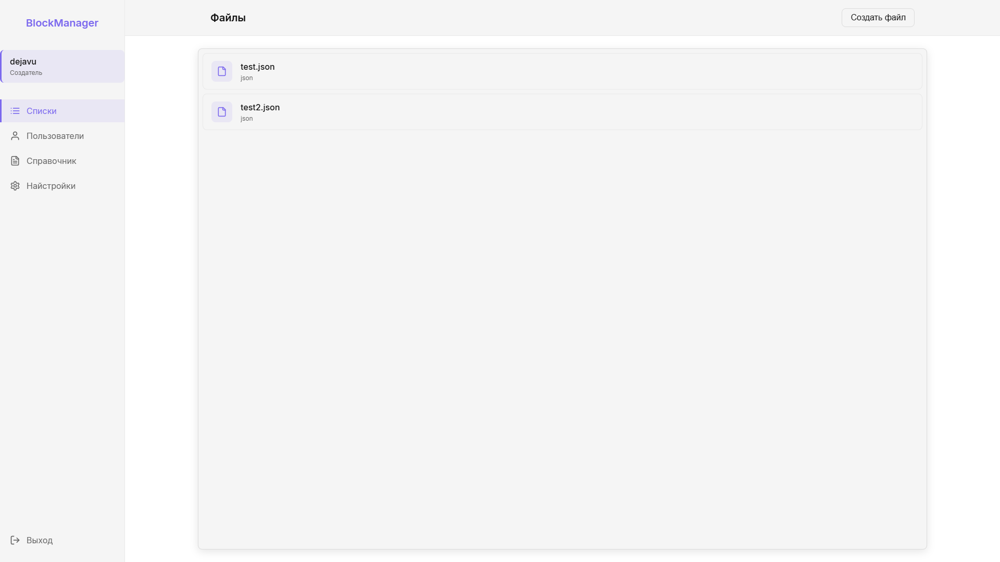
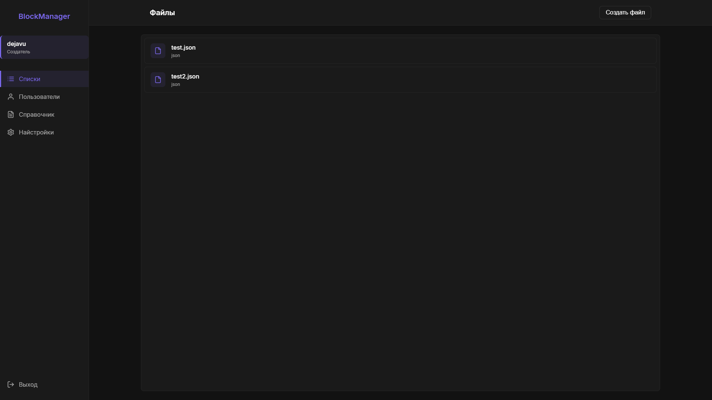
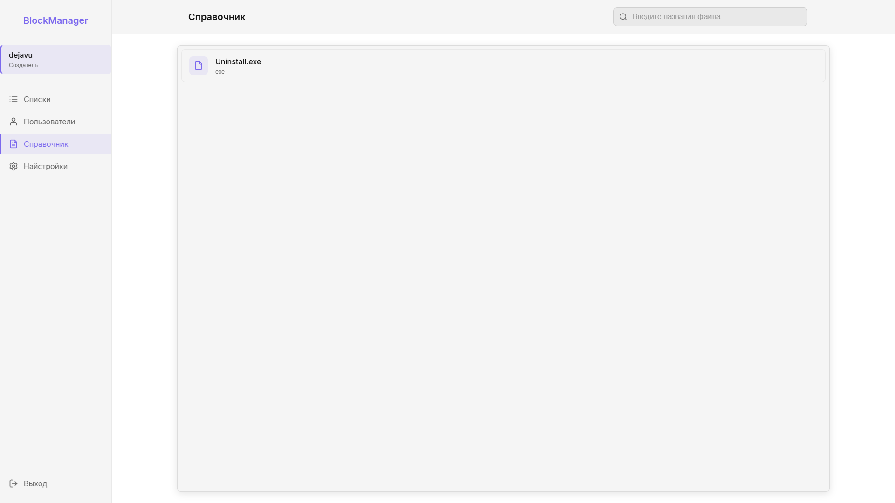
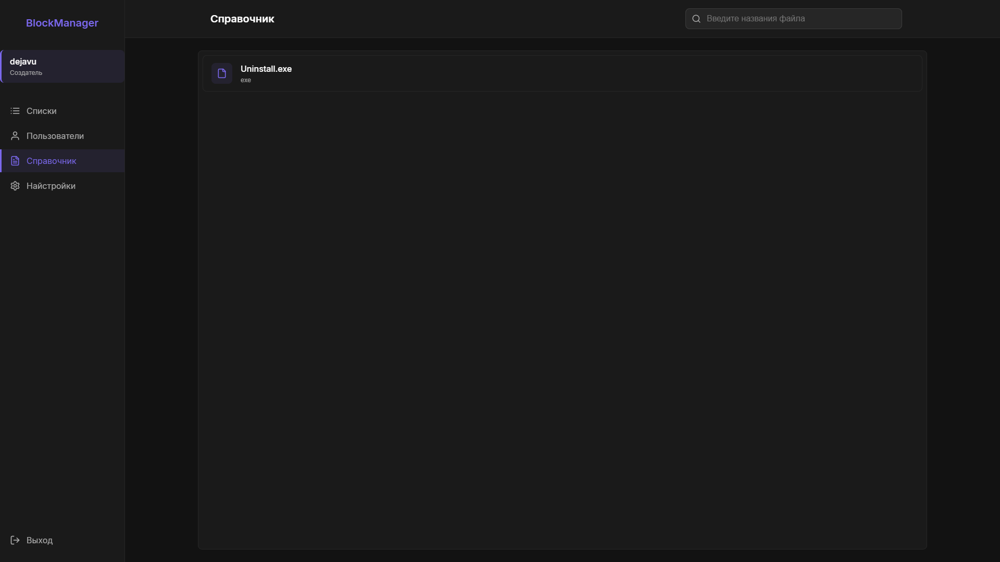
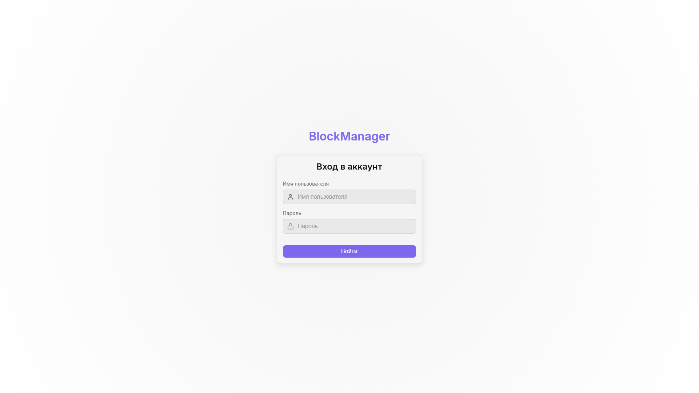
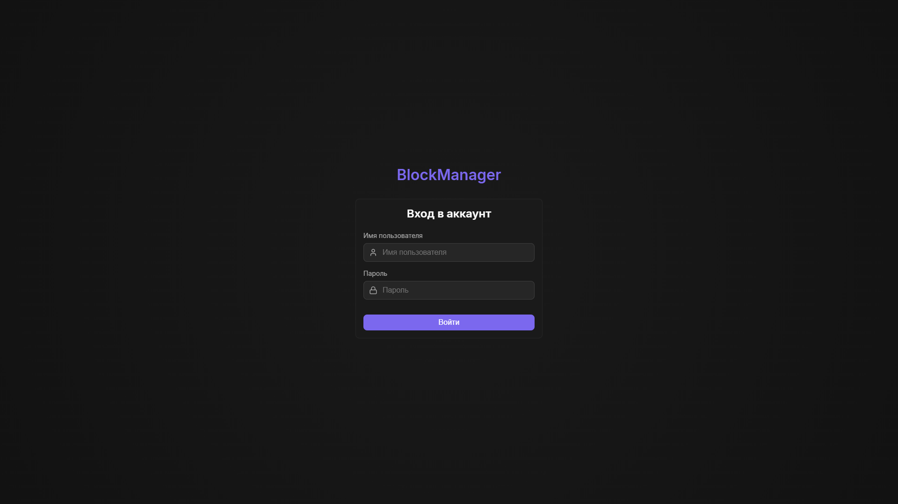

# BlockManager Server - Панель управления списком контроля программ 🛡️

  
  
  
  

**BlockManagerServer** - это лёгкая, современная и безопасная панель для управления списком контроля программ с интуитивно понятным интерфейсом. Проект разработан для удобной работы с конфигурационным файлом: добавления, редактирования и удаления записей. Все данные хранятся в JSON-файле, что делает решение простым в развёртывании и использовании.

---

## 👥 Клиентское приложение

> Для работы с сервером необходимо установить [клиентскую часть](https://github.com/dejavugd/BlockManager/releases) программного обеспечения.

---

## 🌟 Возможности

- 📋 Создание списка программ
- ✏️ Удобное редактирование списка
- ➕ Быстрое добавление новых записей
- 🗑️ Удаление программ
- 🌙 Поддержка светлой и тёмной тем
- 🔒 Авторизация с настройками уровня доступа
- ⚙️ Централизованная настройка доступа
- 🚀 Низкое потребление ресурсов
- 🎨 Сохранение темы как на сервере, так и в cookies

---

## 🛠️ Установка

<b>🔧 Ручная установка</b>

1. Скачайте [последнюю версию архива](https://github.com/dejavugd/BlockManagerServer/releases)
2. Распакуйте архив в удобное место
3. Запустите **BMServer.exe**
4. Перейдите по адресу http://{Ваш IP-адрес|DNS}:8083/
5. Создайте первого пользователя

<b>🔄 Автозагрузка</b>

1. Запустите программу **BMServer.exe**
2. В системном трее кликните правой кнопкой мыши по иконке программы
3. Выберите пункт "Открыть"
4. Активируйте опцию "Запускать при старте системы"
5. Перезагрузите компьютер

---

## 📸 Скриншоты

| Светлая тема | Тёмная тема |
|--------------|-------------|
|  |  |
|  |  |
|  |  |

---

## 👨‍💻 Автор

  
   
  

---

## 📜 Лицензия

Проект распространяется под лицензией **MIT**.  
Допускается как личное, так и коммерческое использование.
